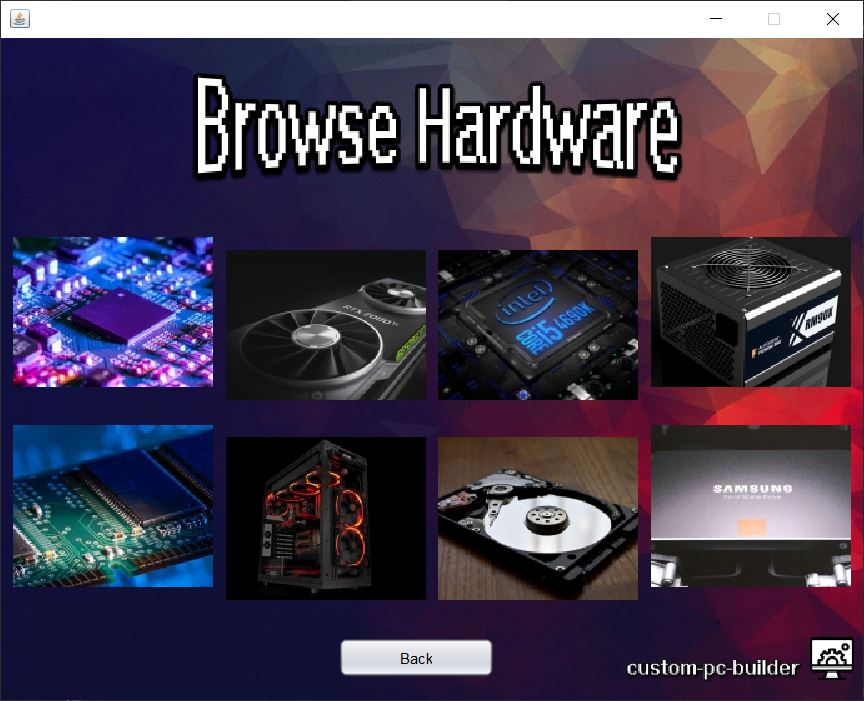
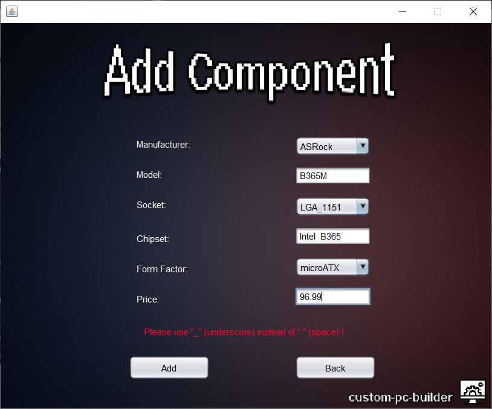
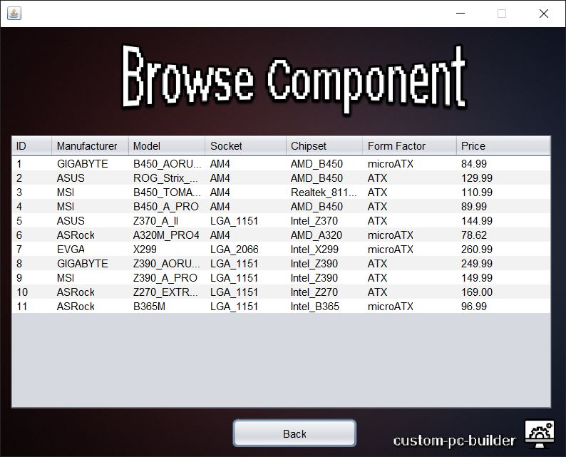

# custom-pc-builder
<!--<strong>Version: 1.0</strong>-->

## ℹ About:
- **Java GUI Application with SQL connectivity dedicated to building a custom PC with user chosen hardware.**

## ✔ Current Features:
- Create and Login with an account on a local db and browse the planned features.

- Browse the hardware components menu.

- Browse and Add new component.

## ☁ Planned Features:
- Create a Custom PC with a variety of hardware components. 
- Save and Load custom setups from a local DB. 
- Add custom hardware components and use them in a setup. 
- More features to be added.
