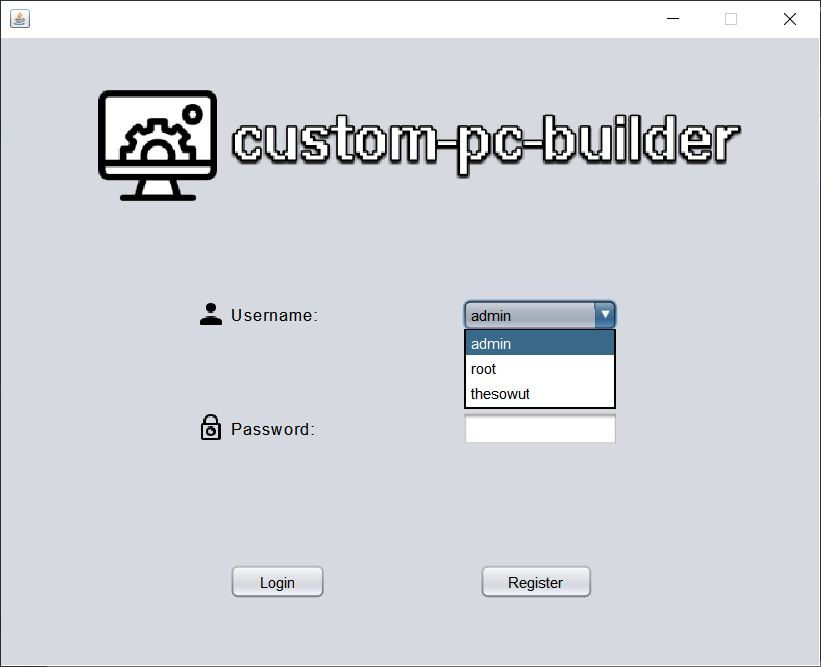
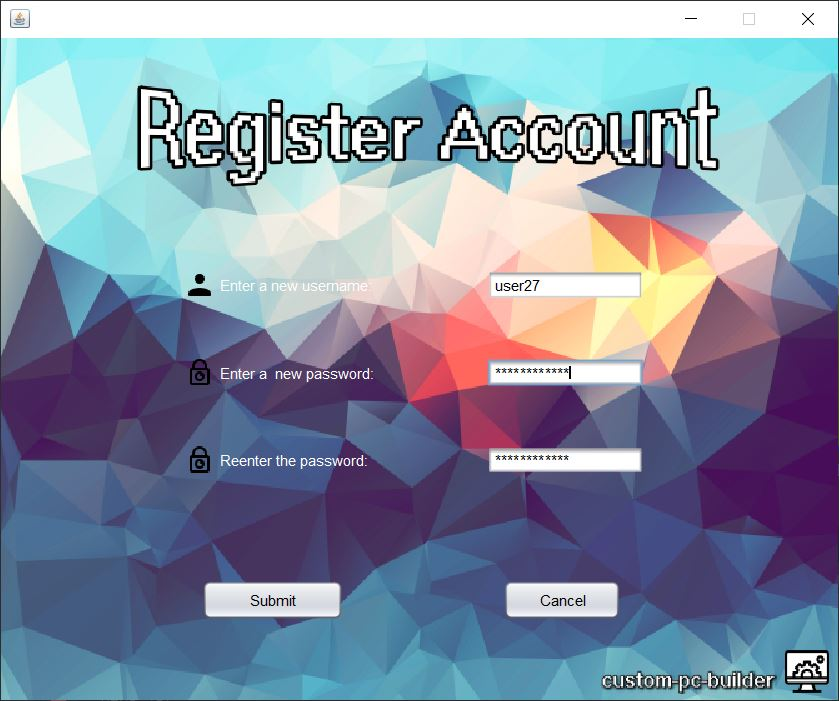

# custom-pc-builder
<!--<strong>Version: 1.0</strong>  -->
<strong>ℹ About:</strong> 
Java GUI Application with SQL connectivity dedicated to building a custom PC with user chosen hardware.

<b>✔ Current Features:</b> 
Create and Login with an account on a local DB. 

<b>☁ Planned Features:</b> 
Create a Custom PC with a variety of hardware components. 
Save and Load custom setups from a local DB. 
Add custom hardware components and use them in a setup. 
More features to be added.
