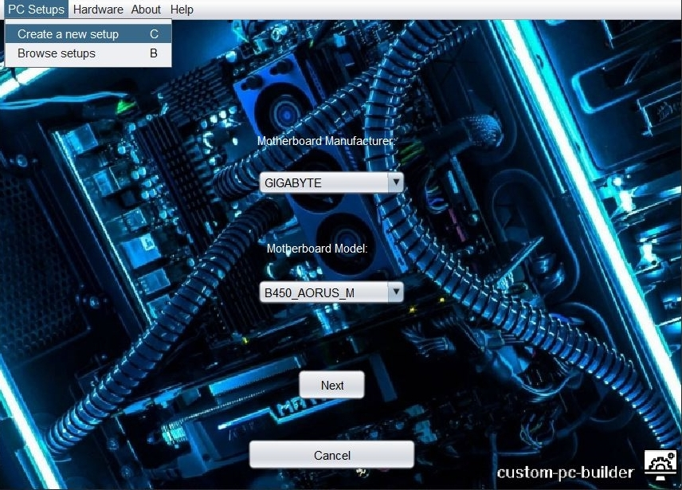
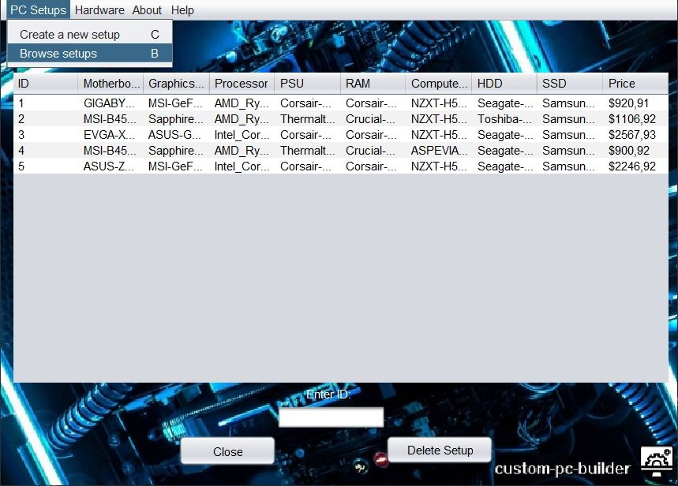

# custom-pc-builder
<!--<strong>Version: 1.0</strong>-->

## ℹ About:
- **Java GUI Application with SQL connectivity dedicated to building a custom PC with user chosen hardware.**

## ✔ Current Features:
- Create and Login with an Account on a Local DB.

- Browse a Variety of Hardware Components used in Setup Creation.

- Browse and Add new Hardware Components of your choice.

- Create new Setups and Browse Existing ones.

## ☁ Planned Features:
- Option for Component removal and updating.
